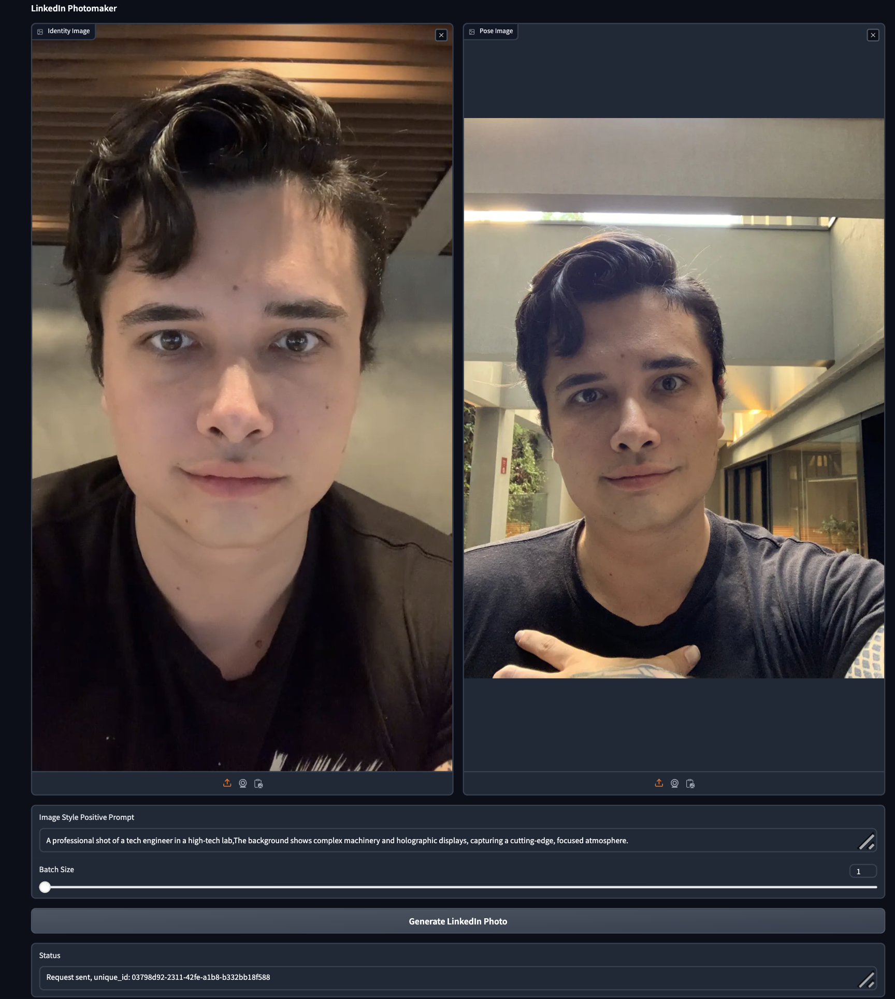

# Creating Your Very Own Linkedin Photo Generator

)


This repository showcases an example of how to create a comfyui app that can generate custom profile pictures for your social media. It also demonstrates how you can run comfy wokrflows behind a user interface


# Creating your runpod container:

Follow the instructions on the class document to setup runpod: 

# How to run:

If you're on runpod, run 

```
git clone https://github.com/synthhaven/learn_comfyui_apps.git
cd learn_comfyui_apps
```

Now, we will install comfyui, the necessary extensions and all the project requirements. Run these lines, one after the other.
First, run 

```bash
# This will create a virtual environment
python -m venv class_venv
source class_venv/bin/activate
pip install -r requirements.txt

# now, we will install comfyui inside the repository
comfy --workspace=./ComfyUI install
```

This will install comfyUI.


Now, we will have to install some necessary extensions and update them

To do so, ensure you run the node installation script. This will let us download custom extensions and custom nodes that we will need for the class

```bash
./setup.sh
```


Once this step is finished, we are ready to get started. 


Finally, we can run our comfyui server. Run the following command. You will then be able to access it in runpod.


```bash
comfy --workspace=./ComfyUI launch -- --port 9000 --listen 0.0.0.0 --enable-cors-header '*'
```

# Using ComfyUI

Throughout the class, you've learned a lot about different close source model APIs. Those usually handle simple text to image requests.

However, if you want to work on building amazing image AI appplications, you will have to know how to use ComfyUI

Do not let the name fool you. Although comfy enables you to visually build AI image applications, comfy is far from a simple no-code tool.

Comfy contains code for the most advanced approaches available in image models and it gives you the power to even create you own code.

Through this class, we will learn how to do some of the things we learned about image models to get a grasp of ComfyUI. After that, we will create an application that enables us to generate professional quality shots that we can use on our social media.

